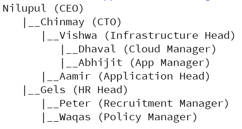
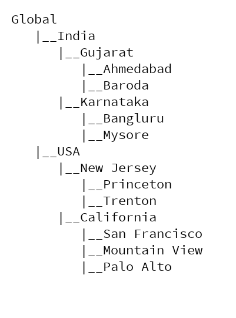
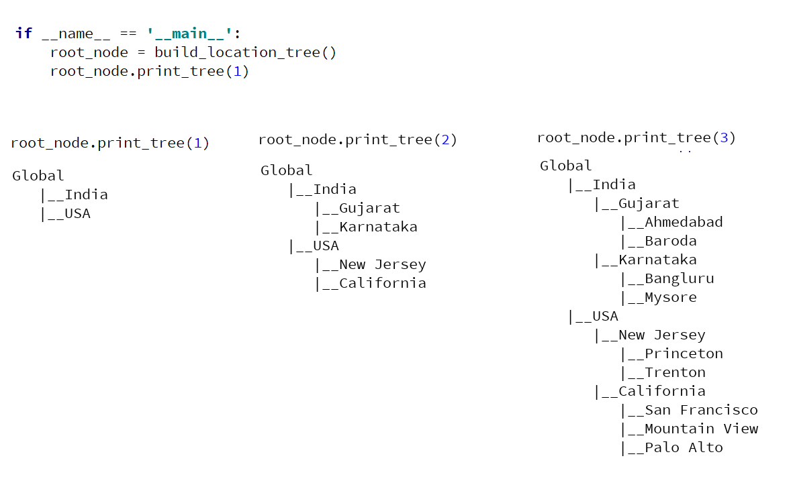

#### Data structures exercise: General Tree

1. Below is the management hierarchy of a company.

    

Extent [tree class](https://github.com/codebasics/py/blob/master/DataStructures/7_Tree/7_tree.py) built in our
main tutorial so that it takes **name** and **designation** in data part of TreeNode class.
Now extend print_tree function such that it can print either name tree, designation tree or name and designation tree. As shown below,

   

Here is how your main function should will look like,
```
if __name__ == '__main__':
    root_node = build_management_tree()
    root_node.print_tree("name") # prints only name hierarchy
    root_node.print_tree("designation") # prints only designation hierarchy
    root_node.print_tree("both") # prints both (name and designation) hierarchy
```

[Solution](https://github.com/codebasics/py/blob/master/DataStructures/7_Tree/Exercise/management_hierarchy.py)

2. Build below location tree using **TreeNode** class

    

Now modify print_tree method to take tree level as input. And that should print tree only upto that level as shown below,

   

[Solution](https://github.com/codebasics/py/blob/master/DataStructures/7_Tree/Exercise/location_hierarchy.py)


