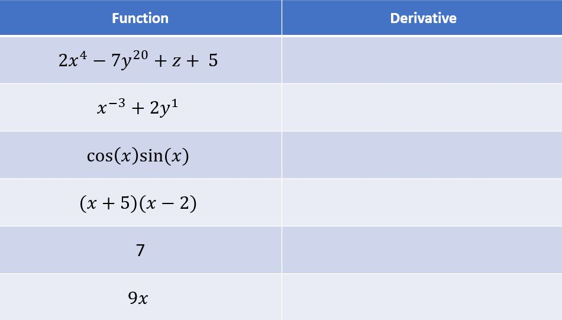

### Exercise: Derivatives & Partial Derivatives

##### Find derivative of following functions

To find answers please refer to derivatives rules at https://www.mathsisfun.com/calculus/derivatives-rules.html

[Click me for solution of above problems](https://github.com/codebasics/py/tree/master/DeepLearningML/3_derivatives/derivatives_exercise_solution.md)

##### Practice more derivative questions by clicking on link below,
[Derivative Exercise](https://www.mathopolis.com/questions/q.html?id=6800&t=mif&qs=6800_6801_6802_6803_6804_6805_6806_6807_6808_6809_6810_6811_6812&site=1&ref=2f63616c63756c75732f64657269766174697665732d72756c65732e68746d6c&title=446572697661746976652052756c6573)

##### Also practice partial derivative questions by clicking on link below,
[Partial Derivatives Exercise](https://www.mathopolis.com/questions/q.html?id=13373&t=mif&qs=13373_13374_13375_13376_13377_13378_13379_13380_13381_13382_13383&site=1&ref=2f63616c63756c75732f64657269766174697665732d7061727469616c2e68746d6c&title=5061727469616c204465726976617469766573)

Thanks mathisfun.com for both of above exercises.
