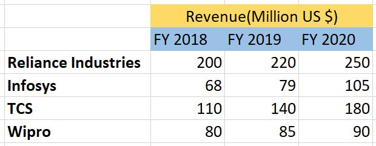
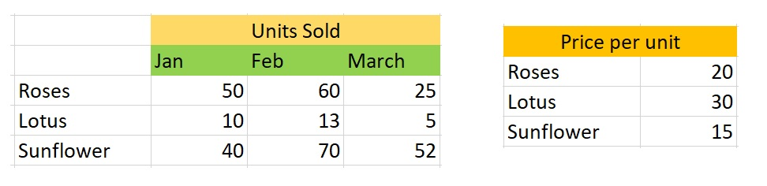

#### Exercise: Matrix Math
1. Below is some indian companies revenues in US dollars. Using numpy can you convert this into Indian rupees? 1 USD = 75 INR

2. Divine flowers is a flower shop that sells different type of flowers. Below is the table showing how many flowers of each type they sold in different months. Also given are the prices of one flower each. Using this find out their total sales in every month.

[Click here for solution of 1 and 2](https://github.com/codebasics/py/tree/master/DeepLearningML/4_matrix_math/4_matrix_math_exercise_solution.ipynb)

3. Here is some matrix exercise from mathisfun.com. Please click on a link below and do the exercise.

[Click me for matrix exercise](https://www.mathopolis.com/questions/q.html?id=714&t=mif&qs=714_715_716_717_2394_2395_2397_2396_8473_8474_8475_8476&site=1&ref=2f616c67656272612f6d61747269782d6d756c7469706c79696e672e68746d6c&title=486f7720746f204d756c7469706c79204d61747269636573)

