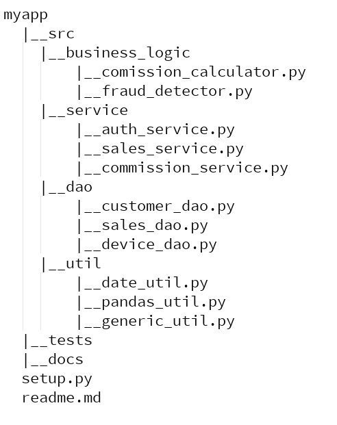

#### 1. Write compact code
For example,
```
def is_high_end_device(device):
    if device.price > 1000 and device.manufacturer=='apple':
        return True
    else:
        return False
```
can be replaced with,
```
def is_high_end_device(device):
    return device.price > 1000 and device.manufacturer=='apple'
```

#### 2. Avoid creating unnecessary variables
*Bad version:*
```
def extract_phone_information(invoice, insurance):
    phone = invoice.item

    p = phone.price
    m = phone.manufacturer
    high_end_flag = False
    if price > 1000 and manufacturer=='apple:
        high_end_flag = True

    insr_active = False
    if insurance.active==1:
        insr_active = True

    phone_info = {
        'manufacturer': m,
        'price': p,
        'is_high_end': high_end_falg,
        'has_active_insurance': insr_active
    }
    return phone_info
```
Creating variables such as p,m,high_end_flag etc are totally unnecessary. We can avoid creating these variables and make code compact by writing it as follows,
can be replaced with,

*Better version:*
```
def extract_phone_information(invoice, insurance):
    phone = invoice.item
    return {
        'manufacturer': phone.manufacturer,
        'price': phone.price,
        'is_high_end': phone.price>1000 and phone.manufacture=='apple',
        'has_active_insurance': insurance.active==1
    }
```

#### 3. Avoid abbreviations as much as you can

*Bad Code:*
```
def is_hed(device):
    return device.price > 1000 and device.manufacturer=='apple'
```
Who the hack knows what **hed** means? When someone new looks at this code the purson would be thinking what is hed? How about we rewrite this function as,

*Better Code:*
```
def is_high_end_device(device):
    return device.price > 1000 and device.manufacturer=='apple'
```
Now if anyone looks at this code, will he or she have any further question on the purpose of this function?

#### 4. Descriptive function and variable names over code comments

The biggest problem with code comments is that they get stale easily. One programmer writes code and add comments but this same code is touched
by 10 other programmers in future, they will change the behavior of the program but they will not update the comments. Now comments become extremly confusing.
How about we use descriptive function and variable names over code comments to explain their purpose?

*Bad Code:*
```
def fraud(trans, cust):
    '''
    This function tells you if transaction is fraud. Input
    parameter trans represents the transaction. cust is for customer.
    '''
    flag = False

    # if device is high end AND customer has not provided any ssn AND
    # customer's state of residence is not equal to store's state then
    # mark that as potential fraud and run further checks
    if is_hed(trans.device) and cust.ssn == None and cust.st != trans.store.st:
        flag=True

    if flag:
        # run further checks
        # return True or False based on these checks

```
*Better Code:*
```
def is_fraudulent_transaction(transaction, customer):

    potential_fraud = False
    if is_high_end_device(transaction.device) \
        and customer.ssn is None \
        and customer.state != transaction.store.state:
        potential_fraud = True

    if potential_fraud:
        # run further checks
        # return True or False based on these checks
```

This code doesn't need any explicit comments. Descriptive variable
and function names and not using abbreviations makes it self explanatory.

#### 5. Don't be too clever, keep it simple!

Don't write tricky code lines that is hard to understand for others. It could be even difficult for author of original code to understand it at later time in future.

*Not So Readable Code:*
```
def process_numbers(input):
    '''
    Create a list that has square of all even numbers in input list
    Now in this list, if number is less then 20 return a list where
    every element is a dictionary containing square and cube of a number
    '''
    return [{'square': n*n, 'cube': n*n*n} for n in [i*i for i in input if i%2==0] if n<20]
```

return live above is so tricky and cryptic that it could give a headache to a person reading that code

*More Readable Code:*
```
def process_numbers(input):
    even_squares = [i*i for i in input if i%2==0]
    processed_list = []
    for n in even_squares:
        if n<20:
            processed_list.append({
                'square': n*n,
                'cube': n*n*n
            })
    return processed_list
```

All though first version of code is compact, it is so tricky and hard to read that second version is preferred.

#### 6. Too much nested code kills code readability
Check if you can avoid deep nesting in your code.

*Average Code:*
```
for i in range(100):
    if condition_1:
        if condition_2:
            if condition_3 and condition_4:
                return True
            else:
                return False
        else:
            return False
    else:
        return False
```
*Better Code:*
```
for i in range(100):
    if not condition_1 or not condition_2:
        return False
    return condition_3 and condition_4

```

#### 7. Consistent coding style and naming convention

Team working on a codebase should agree upon a coding style/naming convention and follow it consistently.
There is no single answer on which convention is the best. Whatever it is, it has to be consistent throughout the code base.

*Bad Code*
```
def isFraudulent_transaction(transaction, customer):

    potentialFraud = False
    is_fraud = False

    if is_high_end_device(transaction.device) \
        and customer.ssn is None \
        and customer.state != transaction.store.state:
        potentialFraud = True

    if potentialFraud:
        if FurtherChecks(transaction, customer):
            is_fraud = True
    return is_fraud
```
Here mix of snake case (e.g is_fraud) and camel case (e.g. potentialFraud)
makes the code look horrible. Use either camel case or snake case consistently.
Using snake case will produce following version,

*Better Code # 1 (Using snake case convention)*
```
def is_fraudulent_transaction(transaction, customer):
    potential_fraud = False
    is_fraud = False

    if is_high_end_device(transaction.device) \
        and customer.ssn is None \
        and customer.state != transaction.store.state:
        potential_fraud = True

    if potential_fraud:
        if further_checks(transaction, customer):
            is_fraud = True
    return is_fraud
```

*Better Code # 2 (Using camel case convention)*
```
def isFraudulentTransaction(transaction, customer):
    potentialFraud = False
    isFraud = False

    if isHighEndDevice(transaction.device) \
        and customer.ssn is None \
        and customer.state != transaction.store.state:
        potentialFraud = True

    if potentialFraud:
        if furtherChecks(transaction, customer):
            isFraud = True
    return isFraud
```

#### 8. Use functions if same code is duplicated at multiple places

*Average Code*
```
def foo():
    if device.price>1000 \
       and device.manufacturer=='apple' \
       and device.version > 5:
        # do something

def bar():
    # some logic
    # some other logic
    if device.price>1000 \
       and device.manufacturer=='apple' \
       and device.version > 5:
        # do something
```

*Better Code*
```
def is_high_end_device(device):
    return device.price>1000 \
       and device.manufacturer=='apple' \
       and device.version > 5

def foo():
    if is_high_end_device(device):
        # do something

def bar():
    # some logic
    # some other logic
    if is_high_end_device(device):
        # do something
```
#### 9. Use right data structures for a given problem

*Inefficient code using list data structure*

```
# extract unique countries
customers = [
    {
        'name': 'John',
        'country': 'USA'
    },
    {
        'name': 'Mohan',
        'country': 'India'
    },
    {
        'name': 'Nancy',
        'country': 'USA'
    },    
    {
        'name': 'Abdul',
        'country': 'India'
    }
]
countries = [] # Use a list
for customer in customers:
    countries.append(customer['country'])

unique_countries = remove_duplicates(countries)
# unique_countries now has ['USA','India']

```
*Better code using set data structure*
```
# extract unique countries
customers = [
    {
        'name': 'John',
        'country': 'USA'
    },
    {
        'name': 'Mohan',
        'country': 'India'
    },
    {
        'name': 'Nancy',
        'country': 'USA'
    },    
    {
        'name': 'Abdul',
        'country': 'India'
    }
]
unique_countries = set() # Use a set 
for customer in customers:
    unique_countries.append(customer['country'])

# unique_countries now has {'India', 'USA'}
```
Here first code snippet uses list data structure to collect unique country names but same code can be made better by using set data structure which gurantees that elements in it are unique.

#### 10. Organize code in multiple folders, files suitable to their purpose
Instead of writing all code in a single file, it is better to organize it
in multiple files and folders. This helps in better management and navigation of the codebase.

Here is a sample python project layout,



At first level: all source code, test code, documentation are separated out into individual folders
Second level: in src folder, all data access objects (a.k.a. dao) are placed in dao folder. external service
calls are inside service folder whereas all utility functions are in util folder
Third level: in util folder, utility functions are organized based on their type. For example, all 
pandas utility functions live in pandas_util.py whereas all date utilities are placed in date_util.py

#### 11. Using Object Oriented Programming
Use object oriented programming (classes, objects etc) whenever appropriate. Using it too less or too much (as in JAVA projects) can create problems. Use your sense of judgement and decide accordingly.

#### 12. Design patterns and architecture patterns 
Get yourself familiar with popular design and architecture patterns. Make use of them wisely.
Here are the names of few popular design and architecture patterns

##### Design Patterns
1. Singleton
2. Abstract Factory
3. Decorator
4. Facade
5. Publish/Subscribe

[Complete list of design patterns](https://en.wikipedia.org/wiki/Software_design_pattern)

##### Architecture Patterns
1. Event Driven Architecture (a.k.a. EDA) [Martin Fowler On EDA](https://www.youtube.com/watch?v=STKCRSUsyP0)
2. Microservices [Martin Fowler's Article On Microservices](https://martinfowler.com/articles/microservices.html)

 [Mark Richard's presentation on invalidating old axioms.](https://cdn.oreillystatic.com/en/assets/1/event/307/Architecture_Next_%20Invalidating%20old%20axioms%20Presentation.pdf) This has payment system example on trade off between microservice and monolith. 


