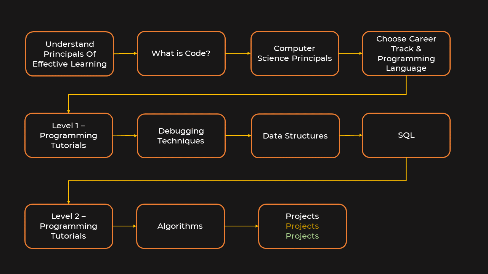

# Step by step guide on how you can learn programming

Below is the 11 step process of how you can start with zero knowledge and no computer science background and master coding skills **for FREE** by following online resources and self study

### Step 1. Understand principals of effective learning

Please watch this video to understand how you can learn effectively so that you can get maximum output by investing minimum amount of time.

https://www.youtube.com/watch?v=ZVO8Wt_PCgE

Quick summary of this video is in the image below,

Here nishant talks about spending less time in input (which is watching coding tutorials, reading programming books etc) and spending more time in reflecting, practicing coding problems and sharing with your friends.

### Step 2. What is Code?

At this step you want to understand what exactly is code. It is a language that you use to communicate with the computer (hence it is called programming ***language***). This video goes elaborates what exactly is code.

https://www.youtube.com/watch?v=hYws-CDXA7k

### Step 3. Computer Science Principals

Program or code runs on a computer and uses CPU,RAM, input/output devices. This khan academy course goes over all these basic principals of computer science. Data is stored as bits (1s and 0s) in RAM and disk. The course will also go over fundamentals of binary numbers.

https://www.khanacademy.org/computing/ap-computer-science-principles/computers-101

### Step 4. Choose Career Track

Being programmer is like being a doctor where there are many different specializations. Doctor can be a heart specialist, a lung doctor
or a general physician. Similarly you can become a web programmer, mobile app developer or backend developer. Here I have outlined
few popular career tracks along with programming languages required for that particular career track,

1. Web Development
    1. HTML/CSS/Javascript - Holy trinity of web programming
    1. Frameworks: node js, react js, vue js etc
1. Mobile App Development
    1. HTML/CSS/Javascript
    1. Native Apps
        1. IOS: Swift programming language
        1. Android: JAVA
    1. Hybrid Apps
        1. React Native
        1. Flutter
1. Data Science, Machine Learning, Backend Development
    1. Python
    1. JAVA

### Step 5. Level 1 Coding Tutorials

At this stage you are ready to write your first program and explore coding tutorials. The idea is to get basic understanding
of programming such as variables, data types, file operation, writing static web pages etc. Below is information on courses
based on career track,

##### 5.1. Web and mobile app development

Here are the links of html/css courses. For codecademy you can create free account and get access of 180 hr 
of content per month. All courses listed below are free.
  
https://www.khanacademy.org/computing/computer-programming/html-css
https://www.codecademy.com/learn/learn-html
https://www.codecademy.com/learn/learn-css

##### 5.2. Data Science, machine learning, backend development

For python, I've build a tutorial playlist for absolute beginners. Watch **first 14** 
tutorails from this playlist. Remaining you can watch at step # 9

Python playlist: https://www.youtube.com/playlist?list=PLeo1K3hjS3uv5U-Lmlnucd7gqF-3ehIh0

Also I've similar playlist in Hindi as well (just in case you are more comfortable with hindi language)

Python hindi tutorials: https://www.youtube.com/playlist?list=PLPbgcxheSpE1DJKfdko58_AIZRIT0TjpO

I've many interesting exercises and their solutions at this place: https://github.com/codebasics/py/tree/master/Basics/Hindi
(The folder name is hindi but exercise is for both hindi and english tutorials)

### Step 6. Debugging skills

All right, at this stage now you have practiced some basic programming. It is time now to develop debuggin skills. 
You can not become a good programmer without sound debugging skills, period. Especially in the early stage
you will run a program and it won't give expected output and you will be wondering what's going on. 
At this point, debugging skills will save you. You can step through the code and find out the exact problem
with your program. I've 3 part tutorial series on debugging skills using pycharm code editor but these 
concepts are applicable in any code editor (or IDE: Integrated Development Environment). 

Debugging tips playlist: https://www.youtube.com/playlist?list=PLeo1K3hjS3uu-0i4uha0_lZwh5PpIWB1T

Debugging in chrome: https://www.youtube.com/watch?v=H0XScE08hy8

### Step 7. Data Structures

There is not a single programming interview where they don't ask about data structures. Data structures are
fundamental building blocks of any program (doesn't matter which programming language). Follow this playlist 
to get your data structure concepts clear.

Data structures playlist: https://www.youtube.com/playlist?list=PLeo1K3hjS3uu_n_a__MI_KktGTLYopZ12

### Step 8. SQL Basics

Doesn't matter which career track you choose, you need to have good understanding of relational databases 
and SQL (structured query language). Here are some course links for SQL.

SQL basics on khan academy: https://www.khanacademy.org/computing/computer-programming/sql
Kudavenkat SQL playlist (watch first 12 videos): https://www.youtube.com/playlist?list=PL08903FB7ACA1C2FB

For kudavenkat playlist above, if you are interested in going little more deeper into SQL then you can 
watch tutorials beyond # 12.

### Step 9. Level 2 Coding Tutorials

At this stage, now you know some basic coding, data structures, SQL etc. You can now go through intermediate 
coding tutorials. Here are some online resources for the same,

##### 9.1 Python

Codebasics python tutorials (tutorial # 15 and onwards): https://www.youtube.com/playlist?list=PLeo1K3hjS3uv5U-Lmlnucd7gqF-3ehIh0

##### 9.2 Web and mobile app development

Interactive weg pages: https://www.khanacademy.org/computing/computer-programming/html-css-js
JQuery: https://www.khanacademy.org/computing/computer-programming/html-js-jquery

### Step 10. Algorithms

Algorithms are applicable to any programming language. Understanding algorithms will help you evaluate
inner working of your program, performance measurement using Big O complexity etc.

https://www.khanacademy.org/computing/computer-science/algorithms

### Step 11. Projects, Projects, Projects

Throughout your journey of step 1 to 11, you need to adhere to a principal of **project based learning**
Which means have a project and then learn each of the skills required to finish that project step by step. 
Once you finished one project move onto another. As you work on more projects you will learn new skills 
and become better and better at programming
