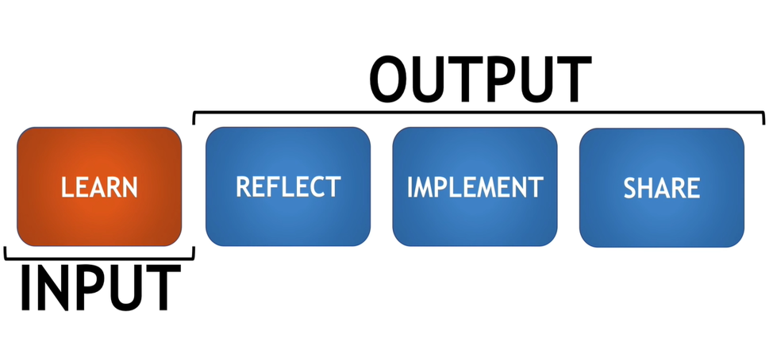

# Step by step guide on how you can learn programming

Below is the 11 step process of how you can start with zero knowledge and no computer science background and master coding skills

### Step 1. Understand principals of effective learning

Please watch this video to understand how you can learn effectively so that you can get maximum output by investing minimum amount of time.

https://www.youtube.com/watch?v=ZVO8Wt_PCgE

Quick summary of this video is in the image below,

Here nishant talks about spending less time in input (which is watching coding tutorials, reading programming books etc) and spending more time in reflecting, practicing coding problems and sharing with your friends.

### Step 2. What is Code?

At this step you want to understand what exactly is code. It is a language that you use to communicate with the computer (hence it is called programming ***language***). This video goes elaborates what exactly is code.

https://www.youtube.com/watch?v=hYws-CDXA7k

### Step 3. Computer Science Principals

Program or code runs on a computer and uses CPU,RAM, input/output devices. This khan academy course goes over all these basic principals of computer science. Data is stored as bits (1s and 0s) in RAM and disk. The course will also go over fundamentals of binary numbers.

https://www.khanacademy.org/computing/ap-computer-science-principles/computers-101

### Step 4. Choose Career Track

Being programmer is like being a doctor where there are many different specializations. Doctor can be a heart specialist, a lung doctor
or a general physician. Similarly you can become a web programmer, mobile app developer or backend developer. Here I have outlined
few popular career tracks along with programming languages required for that particular career track,

1. Web Development
    1. HTML/CSS/Javascript - Holy trinity of web programming
    1. Frameworks: node js, react js, vue js etc
1. Mobile App Development
    1. HTML/CSS/Javascript
    1. Native Apps
        1. IOS: Swift programming language
        1. Android: JAVA
    1. Hybrid Apps
        1. React Native
        1. Flutter
1. Data Science, Machine Learning, Backend Development
    1. Python
    1. JAVA

### Step 5. Level 1 Coding Tutorials

At this stage you are ready to write your first program and explore coding tutorials. The idea is to get basic understanding
of programming such as variables, data types, file operation, writing static web pages etc. Below is information on courses
based on career track,

1. Web and mobile app development

1. Data science, backend development

